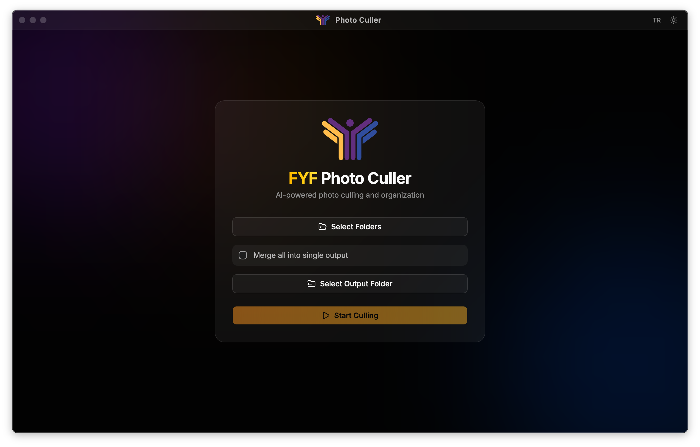

<p align="center">
  
</p>

<h1 align="center">FYF Photo Culler</h1>

<p align="center">
  <strong>AI-powered photo culling and organization for FRC competition photography</strong>
</p>

<p align="center">
  <a href="#download">Download</a> &middot;
  <a href="#features">Features</a> &middot;
  <a href="#screenshot">Screenshot</a> &middot;
  <a href="#getting-started">Getting Started</a> &middot;
  <a href="#tech-stack">Tech Stack</a> &middot;
  <a href="#contributing">Contributing</a> &middot;
  <a href="#license">License</a>
</p>

<p align="center">
  <a href="https://github.com/fikretyukselit/fyf-photo-culler/releases/latest"></a>
  
  
  
  <a href="https://github.com/fikretyukselit/fyf-photo-culler/releases"></a>
</p>

---

An open-source desktop application built by volunteers of **[Fikret Yuksel Foundation](https://fikretyukselfoundation.org)**. Designed to help FRC (FIRST Robotics Competition) media teams quickly sort through hundreds of competition photos — keeping the best shots, detecting duplicates, and organizing everything automatically.

## Download

<table>
  <tr>
    <th>Platform</th>
    <th>File</th>
    <th>Notes</th>
  </tr>
  <tr>
    <td><strong>macOS (Apple Silicon)</strong></td>
    <td><a href="https://github.com/fikretyukselit/fyf-photo-culler/releases/latest/download/FYF.Photo.Culler_0.1.1_aarch64.dmg">📦 .dmg (ARM)</a></td>
    <td>M1, M2, M3, M4 Macs</td>
  </tr>
  <tr>
    <td><strong>macOS (Intel)</strong></td>
    <td><a href="https://github.com/fikretyukselit/fyf-photo-culler/releases/latest/download/FYF.Photo.Culler_0.1.1_x64.dmg">📦 .dmg (x64)</a></td>
    <td>Pre-2020 Intel Macs</td>
  </tr>
  <tr>
    <td><strong>Windows</strong></td>
    <td><a href="https://github.com/fikretyukselit/fyf-photo-culler/releases/latest/download/FYF.Photo.Culler_0.1.1_x64-setup.exe">📦 .exe Installer</a></td>
    <td>Windows 10/11 (64-bit)</td>
  </tr>
  <tr>
    <td><strong>Linux (Debian/Ubuntu)</strong></td>
    <td><a href="https://github.com/fikretyukselit/fyf-photo-culler/releases/latest/download/FYF.Photo.Culler_0.1.1_amd64.deb">📦 .deb</a></td>
    <td>Ubuntu, Debian, Pop!_OS</td>
  </tr>
  <tr>
    <td><strong>Linux (Fedora/RHEL)</strong></td>
    <td><a href="https://github.com/fikretyukselit/fyf-photo-culler/releases/latest/download/FYF.Photo.Culler-0.1.1-1.x86_64.rpm">📦 .rpm</a></td>
    <td>Fedora, RHEL, openSUSE</td>
  </tr>
  <tr>
    <td><strong>Linux (Universal)</strong></td>
    <td><a href="https://github.com/fikretyukselit/fyf-photo-culler/releases/latest/download/FYF.Photo.Culler_0.1.1_amd64.AppImage">📦 .AppImage</a></td>
    <td>All Linux distros</td>
  </tr>
</table>

> **Auto-update:** The app automatically checks for new versions. You'll get an in-app notification when an update is available.

## Screenshot

<p align="center">
  
</p>

## Features

- **Technical Quality Analysis** — Evaluates sharpness, exposure, contrast, and EXIF data to score each photo (0–100)
- **Duplicate & Burst Detection** — Finds exact duplicates (perceptual hashing + SSIM) and burst/similar shots (feature matching), keeps only the best from each group
- **Smart Organization** — Automatically categorizes photos into Keep / Maybe / Reject
- **Manual Review & Override** — Browse photos in a gallery view, drag between categories, batch operations with keyboard shortcuts
- **Multi-folder Input** — Select multiple folders, optionally merge into a single output
- **Export** — Copy organized photos to output folder with progress tracking
- **Dark & Light Mode** — Toggle between themes, glassmorphism UI with FYF brand colors
- **Bilingual** — Full Turkish and English language support (TR / EN)
- **Cross-platform** — Native desktop app for macOS (.dmg), Windows (.exe), and Linux (.deb / .AppImage)

## Getting Started

### Prerequisites

- [Bun](https://bun.sh) (v1.0+)
- [Rust](https://rustup.rs) (latest stable)
- Python 3.9+

### Development Setup

```bash
# Clone the repo
git clone https://github.com/fikretyukselit/fyf-photo-culler.git
cd fyf-photo-culler

# Install Python dependencies
pip install fastapi "uvicorn[standard]" opencv-python-headless Pillow imagehash scikit-image tqdm numpy

# Start the Python backend (Terminal 1)
python3 -m backend.server

# Install frontend dependencies and start the app (Terminal 2)
cd ui
bun install
bun run tauri dev
```

The backend will print `BACKEND_PORT=9470` — the frontend connects to it automatically.

### Building for Production

```bash
# Build Python sidecar binary
pyinstaller --onefile --name fyf-backend backend/server.py \
  --hidden-import culling --add-data "culling:culling"

# Copy to Tauri binaries directory
cp dist/fyf-backend ui/src-tauri/binaries/fyf-backend-$(rustc -vV | grep host | awk '{print $2}')

# Build the app
cd ui && bun run tauri build
```

Output: `.dmg` (macOS), `.exe` installer (Windows), or `.deb` / `.AppImage` (Linux) in `ui/src-tauri/target/release/bundle/`

## Tech Stack

| Layer | Technology |
|-------|-----------|
| **Desktop Shell** | [Tauri 2.0](https://tauri.app) |
| **Frontend** | React + TypeScript + Vite |
| **UI Components** | [shadcn/ui](https://ui.shadcn.com) + Tailwind CSS |
| **State Management** | Zustand |
| **Backend** | Python + FastAPI (localhost sidecar) |
| **Image Analysis** | OpenCV, Pillow, imagehash, scikit-image |
| **Package Manager** | Bun |

## Architecture

```
fyf-photo-culler/
├── backend/              # FastAPI server (Python sidecar)
│   ├── server.py         # App entry + port discovery
│   ├── state.py          # In-memory session state
│   ├── thumbnail.py      # Thumbnail generation/caching
│   └── routes/           # REST API endpoints
│       ├── analysis.py   # POST /analyze, GET /progress (SSE)
│       ├── photos.py     # Photo listing, thumbnails, metadata
│       ├── review.py     # Manual override endpoints
│       └── export.py     # File export with progress
├── culling/              # Core analysis engine
│   ├── technical.py      # Quality scoring (sharpness, exposure, contrast)
│   ├── duplicates.py     # Duplicate & burst detection (pHash, SSIM, ORB)
│   ├── organizer.py      # File organization & reporting
│   └── utils.py          # Image loading, thumbnails, file utilities
├── ui/                   # Tauri + React desktop app
│   ├── src/
│   │   ├── components/   # React components (Landing, Review, Export...)
│   │   └── lib/          # API client, stores, i18n
│   └── src-tauri/        # Rust config + sidecar management
└── pyproject.toml        # Python project metadata
```

**Data flow:** Tauri launches Python sidecar → sidecar starts FastAPI on localhost → frontend calls REST API with SSE for real-time progress.

## Keyboard Shortcuts (Review Screen)

| Key | Action |
|-----|--------|
| `K` | Move selected to Keep |
| `M` | Move selected to Maybe |
| `R` | Move selected to Reject |
| `A` | Select all in current category |
| `Esc` | Clear selection |
| `Space` | Toggle selection |
| `Arrow keys` | Navigate photos |

## Contributing

This is an open-source project by FYF volunteers. Contributions are welcome!

1. Fork the repo
2. Create a feature branch (`git checkout -b feature/amazing-feature`)
3. Commit your changes
4. Push to the branch (`git push origin feature/amazing-feature`)
5. Open a Pull Request

## About Fikret Yuksel Foundation

[Fikret Yuksel Foundation](https://fikretyukselfoundation.org) is a non-profit organization dedicated to inspiring and educating young students, enabling them to discover and develop their potential while fostering Turkey's growth. This tool was built to support our FRC robotics teams' media operations.

<p align="center">
  
  <br />
  <sub>Made with care by FYF volunteers</sub>
</p>
