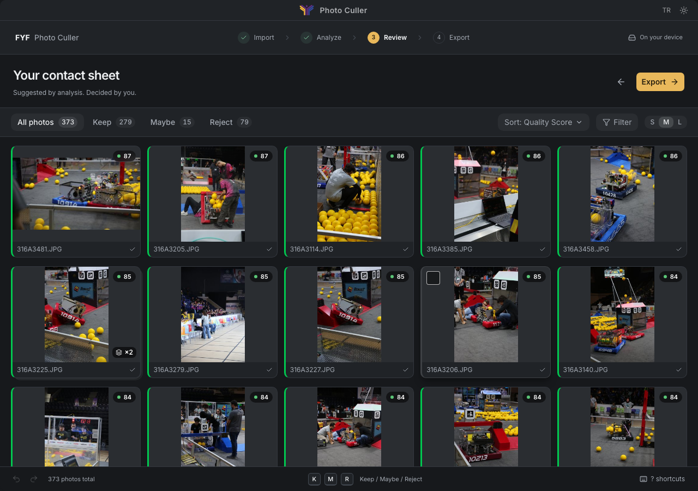
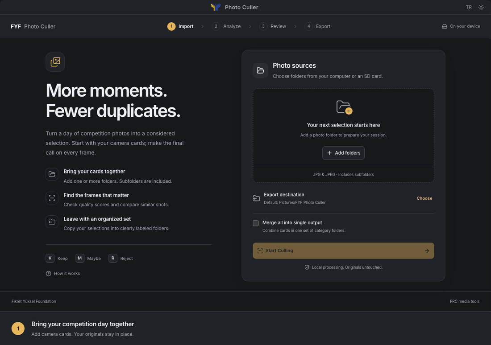
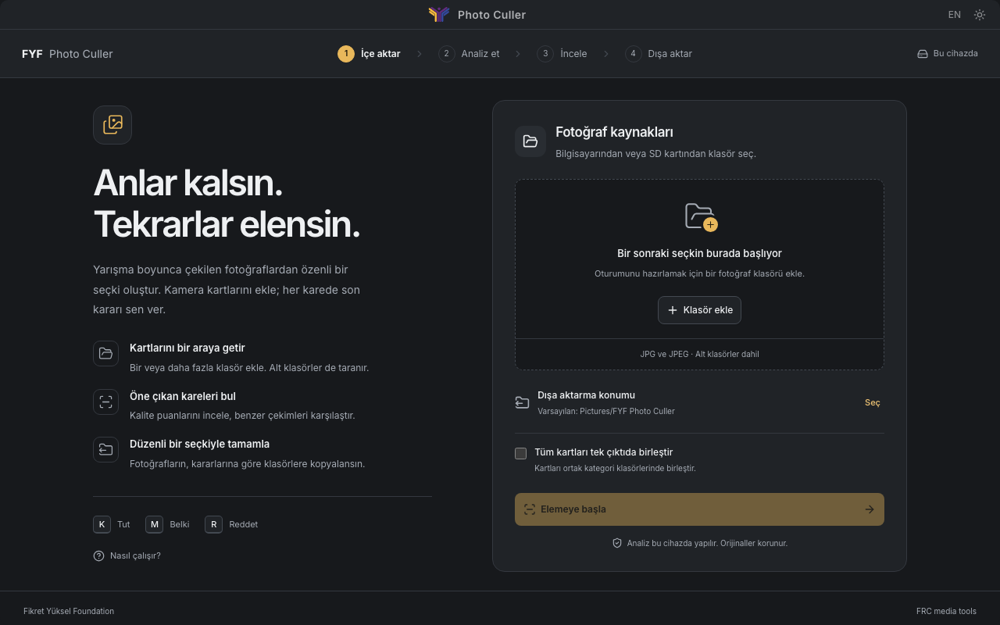

<p align="center">
  
</p>

<h1 align="center">FYF Photo Culler</h1>

<p align="center">
  <strong>Free, open-source photo culling for FIRST Robotics Competition (FRC) and FIRST Tech Challenge (FTC) event photography</strong>
</p>

<p align="center">
  <a href="#download">Download</a> &middot;
  <a href="#who-is-this-for">Who is this for</a> &middot;
  <a href="#features">Features</a> &middot;
  <a href="#see-the-workflow">Demo</a> &middot;
  <a href="#getting-started">Getting Started</a> &middot;
  <a href="#tech-stack">Tech Stack</a> &middot;
  <a href="#contributing">Contributing</a> &middot;
  <a href="#license">License</a>
</p>

<p align="center">
  <a href="https://github.com/fikretyukselit/fyf-photo-culler/releases/latest"></a>
  
  
  
  <a href="https://github.com/fikretyukselit/fyf-photo-culler/releases"></a>
</p>

---

A free, open-source desktop application built by volunteers of **[Fikret Yuksel Foundation](https://fikretyukselfoundation.org)**. It helps FIRST Robotics Competition (FRC) media teams and event photography volunteers sort through hundreds or thousands of competition photos in minutes: it scores sharpness and exposure, detects duplicates and burst sequences, suggests Keep / Maybe / Reject, and exports organized folders. No account, no upload, no subscription. Runs on macOS, Windows and Linux.

> **Load your SD cards → review suggested picks → cull with <kbd>K</kbd> <kbd>M</kbd> <kbd>R</kbd> → export, organized.**
> Local computer vision helps you sort. You make the final selection.

## Who is this for

- **FRC team media students** who come home from a district event or regional with several SD cards and a deadline for the team's social posts.
- **FIRST event photography volunteers** covering FRC, FTC (FIRST Tech Challenge) or FLL (FIRST LEGO League) events for the organizers.
- **Mentors and parents** who shoot bursts of match action and want a fast first pass before opening an editor.
- **Anyone culling sports or event photos** who wants a free, offline alternative to paid culling tools. Nothing here is FRC-only; the defaults are tuned for robots in motion under arena lighting.

<details>
<summary><strong>Türkçe özet</strong></summary>

FYF Photo Culler, FIRST Robotics Competition (FRC) ve FTC etkinliklerinde çekilen yüzlerce fotoğrafı hızla ayıklamak için geliştirilmiş ücretsiz ve açık kaynaklı bir masaüstü uygulamasıdır. Netlik ve pozlama puanlaması, tekrar eden ve seri çekim kareleri tespiti, Sakla / Belki / Çıkar önerileri ve düzenli klasörlere dışa aktarma sunar. Fotoğraflar hiçbir sunucuya yüklenmez; tüm analiz bilgisayarınızda çalışır. Arayüz Türkçe ve İngilizce'dir. macOS, Windows ve Linux için [indirme bağlantıları](#download) aşağıdadır. Sorular ve öneriler için [Discussions](https://github.com/fikretyukselit/fyf-photo-culler/discussions) sayfasını kullanabilirsiniz.

</details>

## Download

<table>
  <tr>
    <th>Platform</th>
    <th>File</th>
    <th>Notes</th>
  </tr>
  <tr>
    <td><strong>macOS (Apple Silicon)</strong></td>
    <td><a href="https://github.com/fikretyukselit/fyf-photo-culler/releases/latest/download/FYF-Photo-Culler-macos-arm64.dmg">📦 .dmg (ARM)</a></td>
    <td>M1, M2, M3, M4 Macs</td>
  </tr>
  <tr>
    <td><strong>macOS (Intel)</strong></td>
    <td><a href="https://github.com/fikretyukselit/fyf-photo-culler/releases/latest/download/FYF-Photo-Culler-macos-x64.dmg">📦 .dmg (x64)</a></td>
    <td>Pre-2020 Intel Macs</td>
  </tr>
  <tr>
    <td><strong>Windows</strong></td>
    <td><a href="https://github.com/fikretyukselit/fyf-photo-culler/releases/latest/download/FYF-Photo-Culler-windows-x64-setup.exe">📦 .exe Installer</a></td>
    <td>Windows 10/11 (64-bit)</td>
  </tr>
  <tr>
    <td><strong>Linux (Debian/Ubuntu)</strong></td>
    <td><a href="https://github.com/fikretyukselit/fyf-photo-culler/releases/latest/download/FYF-Photo-Culler-linux-amd64.deb">📦 .deb</a></td>
    <td>Ubuntu, Debian, Pop!_OS</td>
  </tr>
  <tr>
    <td><strong>Linux (Fedora/RHEL)</strong></td>
    <td><a href="https://github.com/fikretyukselit/fyf-photo-culler/releases/latest/download/FYF-Photo-Culler-linux-x86_64.rpm">📦 .rpm</a></td>
    <td>Fedora, RHEL, openSUSE</td>
  </tr>
  <tr>
    <td><strong>Linux (Universal)</strong></td>
    <td><a href="https://github.com/fikretyukselit/fyf-photo-culler/releases/latest/download/FYF-Photo-Culler-linux-amd64.AppImage">📦 .AppImage</a></td>
    <td>All Linux distros</td>
  </tr>
</table>

These links always download the latest stable release for the selected platform.

**macOS first launch:** Current builds use an ad-hoc signature and are not notarized by Apple. After copying the app to Applications and attempting to open it, macOS may require **System Settings → Privacy & Security → Open Anyway**. Use this only for a release you trust. See [Apple’s instructions](https://support.apple.com/en-gb/102445). The broken package signature in v0.2.3 is fixed in v0.2.4; replace the old app with the newer release.

> **Auto-update:** The app automatically checks for new versions. You'll get an in-app notification when an update is available.

## Privacy and conditions of use

Photo analysis runs on your device. The app copies categorized photos on export; it does not upload your photos to us or an AI service. Local previews and session data are saved. Automatic release checks contact GitHub after you accept the notice; cloud-synced folders remain subject to your storage provider's settings.

On first launch, read the bilingual notice and select **I have read the information above and accept the conditions of use** to continue. The full text can be reopened using the book button in the titlebar. Read the [English notice](docs/usage-notice.en.md), [Türkçe bilgilendirme](docs/usage-notice.tr.md) and [MIT License](LICENSE).

## See the workflow

<p align="center">
  
</p>

**One competition. 373 photographs. A clear path from import to export.**

<details>
<summary><strong>Watch the guided walkthrough · about 27 seconds</strong></summary>

<p align="center">
  
</p>

Actual interface captures and calculated scores from an FRC photo session. Analysis and export waits are shortened; demo decisions and export are simulated. Captured before the latest algorithm corrections, so category counts reflect that version. This is a workflow demonstration, not a performance benchmark.

</details>

**Prefer to explore at your own pace?** [Download the interactive guide](docs/tutorial.html), then open the downloaded HTML file in your browser. It works offline, starts paused, and includes chapter navigation, play/pause and keyboard controls. GitHub displays the HTML source; use **Download raw file** to save it.

| Step | What to try |
|------|-------------|
| Import | Add your camera folders; originals stay in place. |
| Review | Inspect suggestions; use <kbd>K</kbd>, <kbd>M</kbd> and <kbd>R</kbd> to decide. |
| Compare | Open a similar-shot group and compare candidates side by side. |
| Export | Check the destination and counts, then copy every category into organized folders. |

<details>
<summary>View the import workspace</summary>



</details>

## Features

### Analysis
- **Technical quality scoring** — sharpness, exposure, contrast and EXIF combine into a 0–100 score for every photo
- **Duplicate & burst detection** — perceptual hashing + SSIM catches exact duplicates; feature matching groups burst/similar shots and auto-picks the best frame
- **Smart categorization** — every photo lands in Keep / Maybe / Reject before you touch anything

The engine uses fixed scoring rules and pHash / SSIM / ORB comparisons, rather than a trained subject-aware model. Similarity rejection requires geometric and regional visual agreement with the retained frame; uncertain focus goes to Maybe. Scores and picks remain suggestions: a sharp background can hide a soft subject, and similar framing can contain different action. See the [algorithm audit and fixes](docs/algorithm-review.md) for reproduced limitations and before/after dataset results.

### Review at speed
- **Keyboard-first culling** — arrow keys move focus, <kbd>K</kbd>/<kbd>M</kbd>/<kbd>R</kbd> decide and auto-advance to the next photo; no clicking required
- **Loupe view** — <kbd>Enter</kbd> opens a fullscreen preview with zoom to full resolution, a filmstrip, and the same one-key triage
- **Per-card filtering** — shooting with multiple cameras? One click isolates a single SD card
- **Compare mode** — 2–4 candidates side by side with synchronized zoom & pan
- **Undo / redo everywhere** — <kbd>⌘Z</kbd> reverses any decision, including batch moves
- **Instant grid** — thumbnails are generated during analysis and served with immutable caching, so scrolling thousands of photos stays smooth

### Workflow
- **Session resume** — close the app mid-cull; every decision is persisted and restored on the next launch
- **Multi-folder input** — several cards at once, merged or per-folder output
- **Organized export** — Keep / Maybe / Reject copied into tidy folders with live progress
- **On-demand walkthrough** — a keyboard-accessible, self-paced introduction without blocking the first import
- **Dark & light mode, TR / EN** — neutral photo workspace with accessible focus, full-frame thumbnails, and responsive tools
- **Cross-platform** — native desktop app for macOS (.dmg), Windows (.exe), and Linux (.deb / .AppImage)

## Getting Started

### Prerequisites

- [Bun](https://bun.sh) (v1.0+)
- [Rust](https://rustup.rs) (latest stable)
- Python 3.9+

### Development Setup

```bash
# Clone the repo
git clone https://github.com/fikretyukselit/fyf-photo-culler.git
cd fyf-photo-culler

# Install Python dependencies
pip install fastapi "uvicorn[standard]" opencv-python-headless Pillow imagehash scikit-image tqdm numpy

# Start the Python backend (Terminal 1)
python3 -m backend.server

# Install frontend dependencies and start the app (Terminal 2)
cd ui
bun install
bun run tauri dev
```

The backend will print `BACKEND_PORT=9470` — the frontend connects to it automatically.

### Building for Production

```bash
# Build Python sidecar binary (same command as the release workflow)
pip install pyinstaller
pyinstaller --onefile --name fyf-backend backend/server.py \
  --hidden-import culling --add-data "culling:culling" --distpath dist/

# Copy to Tauri binaries directory
cp dist/fyf-backend ui/src-tauri/binaries/fyf-backend-$(rustc -vV | grep host | awk '{print $2}')

# Build the app
cd ui && bun run tauri build
```

Output: `.dmg` (macOS), `.exe` installer (Windows), or `.deb` / `.AppImage` (Linux) in `ui/src-tauri/target/release/bundle/`

## Tech Stack

| Layer | Technology |
|-------|-----------|
| **Desktop Shell** | [Tauri 2.0](https://tauri.app) |
| **Frontend** | React + TypeScript + Vite |
| **UI Components** | [shadcn/ui](https://ui.shadcn.com) + Tailwind CSS |
| **State Management** | Zustand |
| **Backend** | Python + FastAPI (localhost sidecar) |
| **Image Analysis** | OpenCV, Pillow, imagehash, scikit-image |
| **Package Manager** | Bun |

## Architecture

```
fyf-photo-culler/
├── backend/              # FastAPI server (Python sidecar)
│   ├── server.py         # App entry + port discovery
│   ├── state.py          # In-memory session state
│   ├── thumbnail.py      # Thumbnail & preview derivatives
│   └── routes/           # REST API endpoints
│       ├── analysis.py   # POST /analyze, GET /progress (SSE)
│       ├── photos.py     # Photo listing, filters, cached image serving
│       ├── review.py     # Manual override endpoints
│       └── export.py     # File export with progress
├── culling/              # Core analysis engine
│   ├── technical.py      # Quality scoring (sharpness, exposure, contrast)
│   ├── duplicates.py     # Duplicate & burst detection (pHash, SSIM, ORB)
│   ├── organizer.py      # File organization & reporting
│   └── utils.py          # Image loading, thumbnails, file utilities
├── ui/                   # Tauri + React desktop app
│   ├── src/
│   │   ├── components/   # React components (Landing, Review, Export...)
│   │   └── lib/          # API client, stores, i18n
│   └── src-tauri/        # Rust config + sidecar management
└── pyproject.toml        # Python project metadata
```

**Data flow:** Tauri launches Python sidecar → sidecar starts FastAPI on localhost → frontend calls REST API with SSE for real-time progress.

**Why it feels fast:** 320px thumbnails and 1024px previews are written during analysis from the already-decoded image (no on-demand full-resolution decodes), versioned image URLs use immutable HTTP caching (ETag/304), and every review decision applies optimistically — the UI never waits for the network. Replacing a source file changes its cache version.

## Keyboard Shortcuts (Review Screen)

| Key | Action |
|-----|--------|
| <kbd>←</kbd> <kbd>→</kbd> <kbd>↑</kbd> <kbd>↓</kbd> | Move focus across the grid |
| <kbd>K</kbd> / <kbd>M</kbd> / <kbd>R</kbd> | Keep / Maybe / Reject the focused photo (or the selection) — auto-advances |
| <kbd>Enter</kbd> | Open the loupe (large view) |
| <kbd>Z</kbd> | Zoom to full resolution in the loupe |
| <kbd>Space</kbd> | Select / deselect the focused photo |
| <kbd>A</kbd> | Select all loaded photos in the current view |
| <kbd>C</kbd> | Compare selected (2–4) |
| <kbd>⌘Z</kbd> / <kbd>⌘⇧Z</kbd> | Undo / Redo |
| <kbd>?</kbd> | Show the shortcuts overlay |
| <kbd>Esc</kbd> | Close panels / clear selection |

## Contributing

This is an open-source project by FYF volunteers, and contributions from other FIRST teams are welcome: bug reports from real events, sample photo sets that fool the scoring, translations, documentation and code. Read [CONTRIBUTING.md](CONTRIBUTING.md) for setup, tests and the pull request flow. Questions and ideas go to [Discussions](https://github.com/fikretyukselit/fyf-photo-culler/discussions); confirmed bugs go to [Issues](https://github.com/fikretyukselit/fyf-photo-culler/issues).

## About Fikret Yuksel Foundation

[Fikret Yuksel Foundation](https://fikretyukselfoundation.org) is a non-profit organization dedicated to inspiring and educating young students, enabling them to discover and develop their potential while fostering Turkey's growth. This tool was built to support our FRC robotics teams' media operations.

<p align="center">
  
  <br />
  <sub>Made with care by FYF volunteers</sub>
</p>
